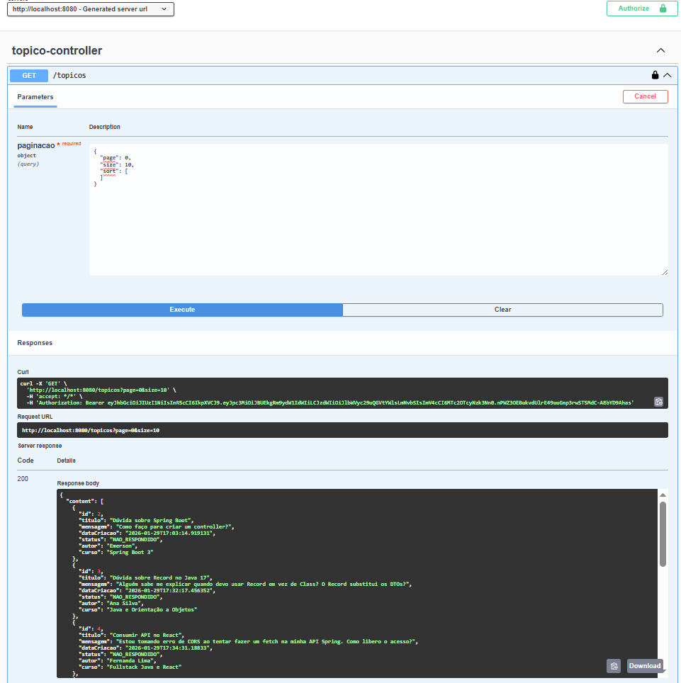

# 📢 ForumHub - Challenge Back-End Alura

Este projeto é uma **API REST** desenvolvida como parte do Challenge Back-End da **Alura**. A aplicação simula o funcionamento de um fórum, permitindo o gerenciamento de tópicos (CRUD) e inclui um sistema robusto de autenticação e segurança.

## 📸 Demonstração
A documentação interativa (Swagger UI) permite testar todos os endpoints. Abaixo, um exemplo de requisição autenticada retornando dados do banco:

## 🔨 Funcionalidades do Projeto

- **Autenticação e Autorização:**
    - Login de usuários com validação de credenciais.
    - Geração de **Token JWT** (JSON Web Token).
    - Controle de acesso (apenas usuários autenticados interagem com a API).
- **CRUD de Tópicos:**
    - Criação de novos tópicos (com validação de duplicidade).
    - Listagem paginada de tópicos.
    - Detalhamento de um tópico específico.
    - Atualização de dados.
    - Exclusão de tópicos.
- **Documentação:**
    - Interface Swagger UI (`/swagger-ui.html`) automatizada e configurada para uso com JWT.

## 🛠️ Tecnologias Utilizadas

* **Java 17**
* **Spring Boot 3**
* **Spring Data JPA** (Hibernate)
* **Spring Security** (Autenticação e Proteção)
* **Auth0 Java-JWT** (Geração de Tokens)
* **Flyway** (Migrações de Banco de Dados)
* **PostgreSQL** (Banco de Dados)
* **Lombok** (Produtividade de código)
* **SpringDoc OpenAPI** (Documentação Swagger)

## 🚀 Como rodar o projeto

### Pré-requisitos
Certifique-se de ter instalado:
* Java 17+
* Maven
* PostgreSQL

   
